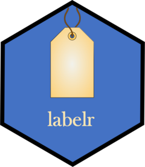

<!-- README.md is generated from README.Rmd. Please edit that file -->

# labelr 

<!-- badges: start -->
<!-- badges: end -->

This package supports creation and use of a few different types of labels 
for R data.frames. Specifically, labelr supports three core types of 
data.frame labels, the last of which comes in three flavors:

1.  **Frame labels** - Each data.frame may be given a single “frame
    label” of 500 characters or fewer, which may describe key general
    features or characteristics of the data set (e.g., source, date
    produced or published, high-level contents).

2.  **Name labels** - Each variable may be given exactly one name label,
    which is an extended variable name or brief description of the
    variable. For example, if a variable called “st_b” refers to a
    survey respondent’s state of birth, then a sensible and useful name
    label might be “State of Birth”. Or, if a variable called “trust1”
    consisted of responses to the consumer survey question, “How much do
    you trust BBC news to give you unbiased information?,” a sensible
    name label might be “BBC Trust.” As such, name labels are comparable
    to what Stata and SAS call “variable labels.”

3.  **Value labels** - labelr offers three kinds of value labels.

    - *One-to-one labels* - The canonical value-labeling use case
      entails mapping distinct values of a variable to distinct labels
      in a one-to-one fashion, so that each value label uniquely
      identifies a substantive value. For instance, an administrative
      data set might assign the integers 1-7 to seven distinct
      racial/ethnic groups, and value labels would be critical in
      mapping those numbers to socially substantive racial/ethnic
      category concepts (e.g., Which number corresponds to the category
      “Asian American?”).

    - *Many-to-one labels* - In an alternative use case, value labels
      may serve to distill or “bucket” distinct variable values in a way
      that deliberately “throws away” information for purposes of
      simplification. For example, one may wish to give the single label
      “Agree” to the responses “Very Strongly Agree,” “Strongly Agree,”
      and “Agree.” Or one may wish to differentiate self-identified
      “White” respondents from “People of Color,” applying the latter
      value label to all categories other than “White.”

    - *Numerical range labels* - Finally, one may wish to carve a
      numerical variable into an ordinal or qualitative range, such as
      dichotomizing a variable or dividing it into quantiles. Numerical
      range labels support one-to-many assignment of a single value
      label to a range of numerical values for a given variable.

## Installation

Assuming devtools is installed, labelr can be installed by calling:

<!-- ``` r -->
<!-- devtools::install_github("brohartman/labelr")``` -->
<!-- ``` -->

## Usage

Assign labels to your data.frame, its variables, and/or specific
variable values. Then use those labels in various ways.

``` r
# load the package and assign mtcars to new data.frame mt2
library(labelr)

mt2 <- mtcars

# assign a data.frame "frame" label
mt2 <- add_frame_lab(mt2, frame.lab = "Data extracted from the 1974 Motor
Trend US magazine, comprising fuel consumption and 10 aspects of automobile
design and performance for 32 automobiles (1973–74 models). Source: Henderson
and Velleman (1981), Building multiple regression models interactively.
                     Biometrics, 37, 391–411.")

get_frame_lab(mt2)
#>   data.frame
#> 1        mt2
#>                                                                                                                                                                                                                                                                                    frame.lab
#> 1 Data extracted from the 1974 MotorTrend US magazine, comprising fuel consumption and 10 aspects of automobiledesign and performance for 32 automobiles (1973–74 models). Source: Hendersonand Velleman (1981), Building multiple regression models interactively. Biometrics, 37, 391–411.

# assign variable name labels
mt2 <- add_name_labs(mt2,
  name.labs = c(
    "mpg" = "Miles/(US) gallon",
    "cyl" = "Number of cylinders",
    "disp" = "Displacement (cu.in.)",
    "hp" = "Gross horsepower",
    "drat" = "Rear axle ratio",
    "wt" = "Weight (1000 lbs)",
    "qsec" = "1/4 mile time",
    "vs" = "Engine (0 = V-shaped, 1 = straight)",
    "am" = "Transmission (0 = automatic, 1 = manual)",
    "gear" = "Number of forward gears",
    "carb" = "Number of carburetors"
  )
)

get_name_labs(mt2)
#>     var                                      lab
#> 1   mpg                        Miles/(US) gallon
#> 2   cyl                      Number of cylinders
#> 3  disp                    Displacement (cu.in.)
#> 4    hp                         Gross horsepower
#> 5  drat                          Rear axle ratio
#> 6    wt                        Weight (1000 lbs)
#> 7  qsec                            1/4 mile time
#> 8    vs      Engine (0 = V-shaped, 1 = straight)
#> 9    am Transmission (0 = automatic, 1 = manual)
#> 10 gear                  Number of forward gears
#> 11 carb                    Number of carburetors

# add 1-to-1 value labels
mt2 <- add_val_labs(
  data = mt2,
  vars = "am",
  vals = c(0, 1),
  labs = c("automatic", "manual")
)
#> 
#>   var vals      labs
#> 1  am    0 automatic
#> 2  am    1    manual
#> 3  am   NA        NA

# add many-to-1 value labels
mt2 <- add_m1_lab(
  data = mt2,
  vars = "gear",
  vals = 4:5,
  lab = "4+"
)
#> 
#>    var vals labs
#> 4 gear    3    3
#> 5 gear    4   4+
#> 6 gear    5   4+
#> 7 gear   NA   NA

# add quartile-based numerical range value labels
mt2 <- add_quant_labs(
  data = mt2,
  vars = "disp",
  qtiles = 4
)
#> 
#>     var    vals labs
#> 8  disp 120.825 q025
#> 9  disp   196.3 q050
#> 10 disp     326 q075
#> 11 disp     472 q100
#> 12 disp      NA   NA

# add "pretty" cut-based numerical range value labels
(mpg_bins <- pretty(range(mt2$mpg, na.rm = TRUE)))
#> [1] 10 15 20 25 30 35

mt2 <- add_quant_labs(data = mt2, vars = "mpg", vals = mpg_bins)
#> Warning in add_quant_labs(data = mt2, vars = "mpg", vals = mpg_bins): 
#> 
#> Some of the supplied vals argument values are outside
#> the observed range of var --mpg-- values
#> 
#>    var vals labs
#> 13 mpg   10 <=10
#> 14 mpg   15 <=15
#> 15 mpg   20 <=20
#> 16 mpg   25 <=25
#> 17 mpg   30 <=30
#> 18 mpg   35 <=35
#> 19 mpg   NA   NA

# show or use value labels
head(use_val_labs(mt2), 4)
#>                 mpg cyl disp  hp drat    wt  qsec vs        am gear carb
#> Mazda RX4      <=25   6 q050 110 3.90 2.620 16.46  0    manual   4+    4
#> Mazda RX4 Wag  <=25   6 q050 110 3.90 2.875 17.02  0    manual   4+    4
#> Datsun 710     <=25   4 q025  93 3.85 2.320 18.61  1    manual   4+    1
#> Hornet 4 Drive <=25   6 q075 110 3.08 3.215 19.44  1 automatic    3    1

# preserve labels and then restore (if lost) or transfer
lab_backup <- get_all_lab_atts(mt2) # back them up

mt2 <- strip_labs(mt2) # strip them away

check_any_lab_atts(mt2) # verify that they have been stripped away
#> [1] FALSE

mt2 <- add_lab_atts(mt2, lab_backup) # now restore them

get_all_lab_atts(mt2) # show that they are back
#> $frame.lab
#> [1] "Data extracted from the 1974 MotorTrend US magazine, comprising fuel consumption and 10 aspects of automobiledesign and performance for 32 automobiles (1973–74 models). Source: Hendersonand Velleman (1981), Building multiple regression models interactively. Biometrics, 37, 391–411."
#> 
#> $name.labs
#>                                        mpg 
#>                        "Miles/(US) gallon" 
#>                                        cyl 
#>                      "Number of cylinders" 
#>                                       disp 
#>                    "Displacement (cu.in.)" 
#>                                         hp 
#>                         "Gross horsepower" 
#>                                       drat 
#>                          "Rear axle ratio" 
#>                                         wt 
#>                        "Weight (1000 lbs)" 
#>                                       qsec 
#>                            "1/4 mile time" 
#>                                         vs 
#>      "Engine (0 = V-shaped, 1 = straight)" 
#>                                         am 
#> "Transmission (0 = automatic, 1 = manual)" 
#>                                       gear 
#>                  "Number of forward gears" 
#>                                       carb 
#>                    "Number of carburetors" 
#> 
#> $val.labs.mpg
#>     10     15     20     25     30     35     NA 
#> "<=10" "<=15" "<=20" "<=25" "<=30" "<=35"   "NA" 
#> 
#> $val.labs.disp
#> 120.825   196.3     326     472      NA 
#>  "q025"  "q050"  "q075"  "q100"    "NA" 
#> 
#> $val.labs.am
#>           0           1          NA 
#> "automatic"    "manual"        "NA" 
#> 
#> $val.labs.gear
#>    3    4    5   NA 
#>  "3" "4+" "4+" "NA"

# add labels-on columns to the data.frame
mt_plus <- add_lab_cols(mt2)

cols_of_interest <- names(mt_plus)[grepl("am|dis|gear|mpg", names(mt_plus))]

head(mt_plus)[sort(cols_of_interest)]
#>                   am    am_lab disp disp_lab gear gear_lab  mpg mpg_lab
#> Mazda RX4          1    manual  160     q050    4       4+ 21.0    <=25
#> Mazda RX4 Wag      1    manual  160     q050    4       4+ 21.0    <=25
#> Datsun 710         1    manual  108     q025    4       4+ 22.8    <=25
#> Hornet 4 Drive     0 automatic  258     q075    3        3 21.4    <=25
#> Hornet Sportabout  0 automatic  360     q100    3        3 18.7    <=20
#> Valiant            0 automatic  225     q075    3        3 18.1    <=20

# show select values with value labels "on"
utils::head(mt2) # head()
#>                    mpg cyl disp  hp drat    wt  qsec vs am gear carb
#> Mazda RX4         21.0   6  160 110 3.90 2.620 16.46  0  1    4    4
#> Mazda RX4 Wag     21.0   6  160 110 3.90 2.875 17.02  0  1    4    4
#> Datsun 710        22.8   4  108  93 3.85 2.320 18.61  1  1    4    1
#> Hornet 4 Drive    21.4   6  258 110 3.08 3.215 19.44  1  0    3    1
#> Hornet Sportabout 18.7   8  360 175 3.15 3.440 17.02  0  0    3    2
#> Valiant           18.1   6  225 105 2.76 3.460 20.22  1  0    3    1

labelr::headl(mt2) # headl
#>                    mpg cyl disp  hp drat    wt  qsec vs        am gear carb
#> Mazda RX4         <=25   6 q050 110 3.90 2.620 16.46  0    manual   4+    4
#> Mazda RX4 Wag     <=25   6 q050 110 3.90 2.875 17.02  0    manual   4+    4
#> Datsun 710        <=25   4 q025  93 3.85 2.320 18.61  1    manual   4+    1
#> Hornet 4 Drive    <=25   6 q075 110 3.08 3.215 19.44  1 automatic    3    1
#> Hornet Sportabout <=20   8 q100 175 3.15 3.440 17.02  0 automatic    3    2
#> Valiant           <=20   6 q075 105 2.76 3.460 20.22  1 automatic    3    1

# "flab" - "*F*ilter using value *LAB*els"
flab(mt2, am == "automatic" & mpg %in% c("<=20"))
#>                    mpg cyl  disp  hp drat    wt  qsec vs am gear carb
#> Hornet Sportabout 18.7   8 360.0 175 3.15 3.440 17.02  0  0    3    2
#> Valiant           18.1   6 225.0 105 2.76 3.460 20.22  1  0    3    1
#> Merc 280          19.2   6 167.6 123 3.92 3.440 18.30  1  0    4    4
#> Merc 280C         17.8   6 167.6 123 3.92 3.440 18.90  1  0    4    4
#> Merc 450SE        16.4   8 275.8 180 3.07 4.070 17.40  0  0    3    3
#> Merc 450SL        17.3   8 275.8 180 3.07 3.730 17.60  0  0    3    3
#> Merc 450SLC       15.2   8 275.8 180 3.07 3.780 18.00  0  0    3    3
#> Dodge Challenger  15.5   8 318.0 150 2.76 3.520 16.87  0  0    3    2
#> AMC Javelin       15.2   8 304.0 150 3.15 3.435 17.30  0  0    3    2
#> Pontiac Firebird  19.2   8 400.0 175 3.08 3.845 17.05  0  0    3    2

# "slab" - "*S*ubset using value *LAB*els"
slab(mt2, am == "automatic" & gear == "4+", am, gear)
#>           am gear
#> Merc 240D  0    4
#> Merc 230   0    4
#> Merc 280   0    4
#> Merc 280C  0    4

# "tabl" - Produce label-friendly tables
tabl(mt2, vars = c("am", "gear"), labs.on = TRUE) # labels on, sorted by freq
#>          am gear  n
#> 1 automatic    3 15
#> 2    manual   4+ 13
#> 3 automatic   4+  4
#> 4    manual    3  0

tabl(mt2, vars = c("am", "gear"), labs.on = FALSE) # labels off (default)
#>   am gear  n
#> 1  0    3 15
#> 2  1    4  8
#> 3  1    5  5
#> 4  0    4  4
#> 5  0    5  0
#> 6  1    3  0

# interactively swap in name labels for column names
# (Note: This is a relatively brittle convenience function that will not support
# ... exotic syntax or pointers to objects that exist outside the labeled
# ... data.frame)
with_name_labs(mt2, t.test(mpg ~ am))
#> 
#>  Welch Two Sample t-test
#> 
#> data:  Miles/(US) gallon by Transmission (0 = automatic, 1 = manual)
#> t = -3.7671, df = 18.332, p-value = 0.001374
#> alternative hypothesis: true difference in means between group 0 and group 1 is not equal to 0
#> 95 percent confidence interval:
#>  -11.280194  -3.209684
#> sample estimates:
#> mean in group 0 mean in group 1 
#>        17.14737        24.39231

# wnl() is a more compact alias for with_name_labs()
wnl(mt2, lm(mpg ~ am * gear))
#> 
#> Call:
#> lm(formula = `Miles/(US) gallon` ~ `Transmission (0 = automatic, 1 = manual)` * 
#>     `Number of forward gears`)
#> 
#> Coefficients:
#>                                                          (Intercept)  
#>                                                                1.277  
#>                           `Transmission (0 = automatic, 1 = manual)`  
#>                                                               44.578  
#>                                            `Number of forward gears`  
#>                                                                4.943  
#> `Transmission (0 = automatic, 1 = manual)`:`Number of forward gears`  
#>                                                               -9.838

# wnl(mt2, hist(mpg)) #not shown, but works
# wnl(mt2, plot(mpg, carb)) #not shown, but works

# interactively swap in both name and value labels
# ...note that "mpg" and "disp" would not work in these calls unless we
# ...first dropped their value labels, since swapping out labels for values
# ...amounts to coercing these to be character variables

wbl(mt2, t.test(qsec ~ am)) # wbl() is alias for with_both_labs()
#> 
#>  Welch Two Sample t-test
#> 
#> data:  1/4 mile time by Transmission (0 = automatic, 1 = manual)
#> t = 1.2878, df = 25.534, p-value = 0.2093
#> alternative hypothesis: true difference in means between group automatic and group manual is not equal to 0
#> 95 percent confidence interval:
#>  -0.4918522  2.1381679
#> sample estimates:
#> mean in group automatic    mean in group manual 
#>                18.18316                17.36000

wbl(mt2, lm(qsec ~ am + gear + wt * drat))
#> 
#> Call:
#> lm(formula = `1/4 mile time` ~ `Transmission (0 = automatic, 1 = manual)` + 
#>     `Number of forward gears` + `Weight (1000 lbs)` * `Rear axle ratio`)
#> 
#> Coefficients:
#>                                      (Intercept)  
#>                                            7.658  
#> `Transmission (0 = automatic, 1 = manual)`manual  
#>                                           -4.419  
#>                      `Number of forward gears`4+  
#>                                            3.097  
#>                              `Weight (1000 lbs)`  
#>                                            4.419  
#>                                `Rear axle ratio`  
#>                                            3.904  
#>            `Weight (1000 lbs)`:`Rear axle ratio`  
#>                                           -1.598
```
